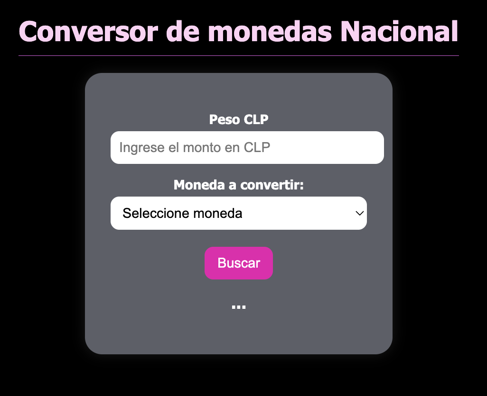
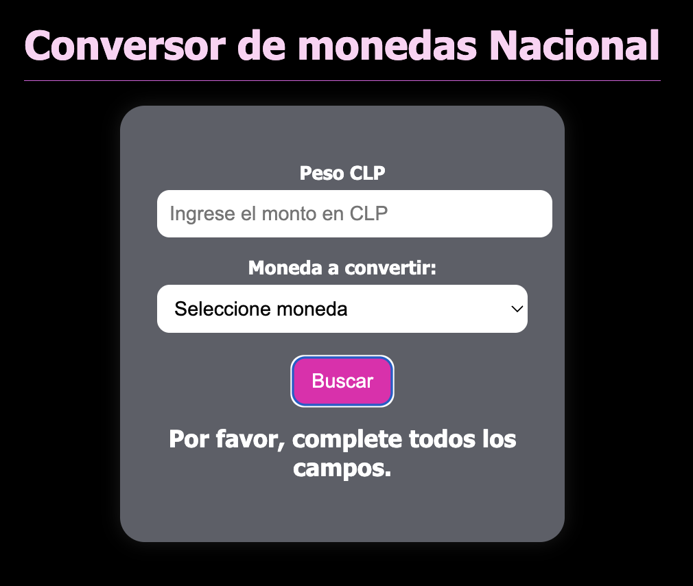
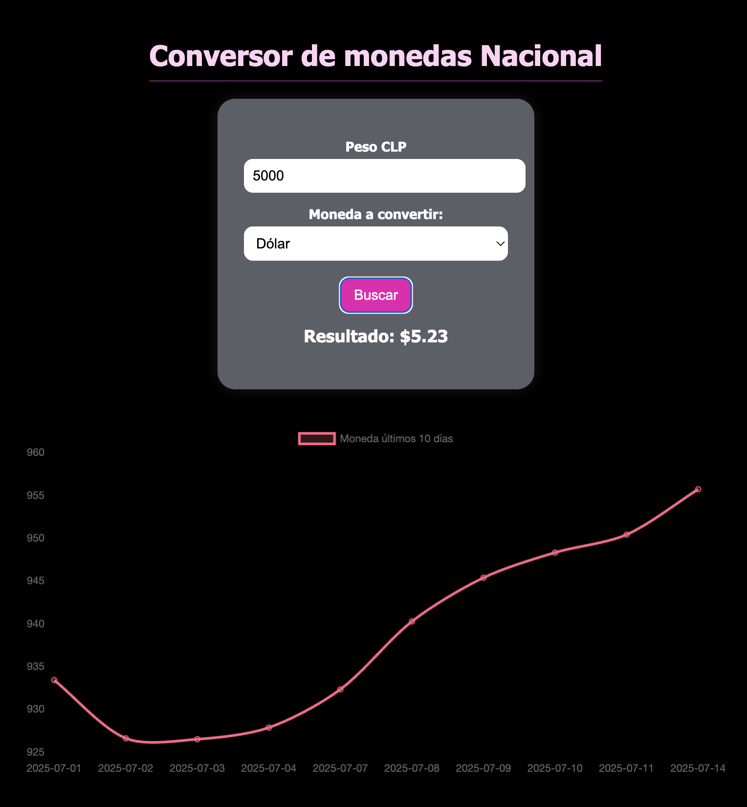
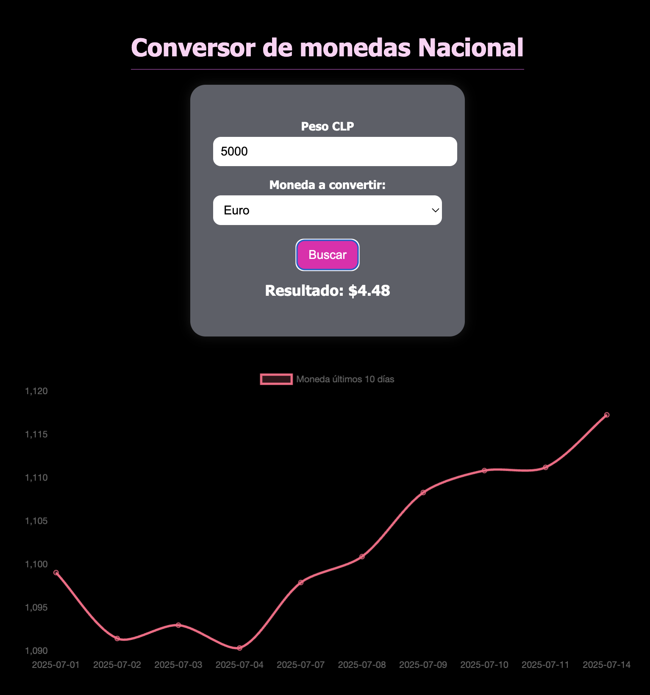

# Prueba: Conversor de monedas

En esta prueba se validará el conocimiento del método fetch. Se deberá programar un convertidor de monedas a partir de un monto en pesos chilenos. Se deberá consultar a una API https://mindicador.cl/api/ usando el método fetch.

## Requerimientos:

1. Se obtienen los tipos de cambio desde mindicador.cl
2. Se calcula correctamente el cambio y se muestra en el DOM.
3. El select implementa más de un tipo de moneda (con 2 es suficiente), todos los
cambios funcionan correctamente.
4. Se usa try catch para ejecutar el método fetch y capturar los posibles errores
mostrando el error en el DOM en caso de que haya problemas.
Tip: Recuerda que la guía de APIs hay un capítulo asociado a “Sentencias Try y
Catch”
5. Se Implementa el gráfico pedido.
Tip: En la guía de APIs hay un capítulo asociado a “Plugins de JavaScript (Chart Js)”. Utiliza esto como referencia para generar el gráfico.

- Se observa al comenzar:

- Se observa sin indicadores:

- Se observa al seleccionar dolar:

- Se observa al seleccionar Euro:

Se puede visualizar en github pages así:

----
Marcela Morales Peralta